# Manual for the use of the optimization code

Andreetta Niccolò niccolo.andreetta@ntnu.no

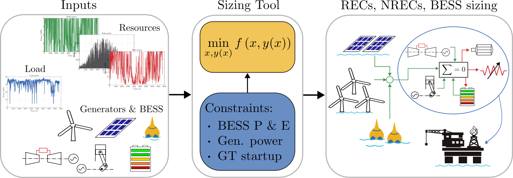

---

This manual and the related code is a work in progress, which is continuously improved by the authors. It is not a finished work and may therefore contain defects or "bugs" inherent to this type of development. For this reason the work is provided without warranties of any kind concerning the work, including without limitation merchantability, fitness for a particular purpose, absence of defects or errors, and accuracy.

---

# Table of Contents

- [Code Capabilities](#code-capabilities)
- [Prerequisites](#prerequisites)
- [Available assets](#available-assets)
- [Configurations](#configurations)
- [Parameter Sweeps](#parameter-sweeps)
- [Code Structure](#code-structure)
- [Optimization: CASE_optimization function](#optimization-case_optimization)
- [Results and Plots](#results-and-plots)

---

# Code Capabilities

The focus of this manual is on the code capabilities and structure, so the reader can gain an understanding on how to use the code.  
The code is developed requiring as input data series of the load and the environmental resources, the different type of assets (generators and storages) that can be installed, and their costs, and provides as output the optimal assets combination to support the load with the given specification. The code is able to perform parametric sweep of some user-defined parameters.  
From the technical perspective the code builds and solves an optimization problem expressed as a Mixed Integer Linear Programming (MILP).

## Prerequisites

The following Matlab products are required:

- Optimization toolbox  
- Statistics and Machine Learning Toolbox  
- Parallel Computing Toolbox  
- Global Optimization Toolbox  

## Available assets

Management of the different devices: Battery Energy Storage System (BESS), Solar PV, Wind Turbine (WT), Diesel Generator (DG), Gas Turbine (GT), and potential extension to Hydrogen Fuel Cell.

## Configurations

Different device configurations can be selected by the user before running the optimization (e.g. `WT+DG`, `REC-U`, `REC-U+DG`, `REC-C+DG24`).

## Parameter Sweeps

It is possible to perform parameter sweep. Examples include risk-related variables, carbon tax, PV cost. When operating on parametric sweep it might be advantageous to parallelize the execution of the code.

---

# Code Structure

## General Workflow

1. Data set import  
2. Device definition  
3. Optimization problem formulation  
4. Post-processing  
5. Results visualization  

## Initialization

Main file: `main_decarbonization.m`  
Select parallel or sequential execution: `enable_parallel_computing` (see Figure 1)

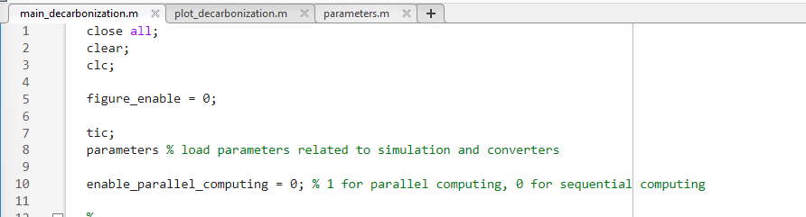{#fig:main_decarbonization width=100%}

## Converters

Defined in `define_converters_corepower_MW_formulation` with all parameters (see Figure 2).  
Converters and storages are defined in classes (see Figure 3).

{#fig:converters width=75%}

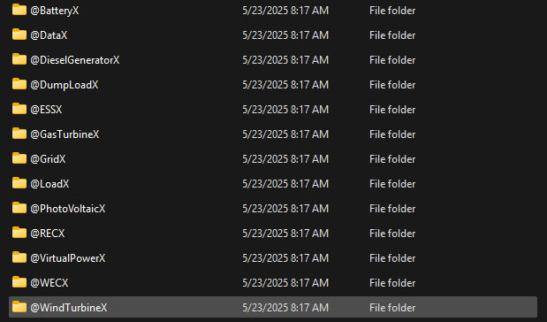{#fig:classes width=40%}

## Dataset Import

`import_datasets_norway_1yr` loads the datasets of load and resources.  
Structure depends heavily on datasets in use, in the sense that the user has to tune the loading function according to the format of the available dataset (see Figure 4).

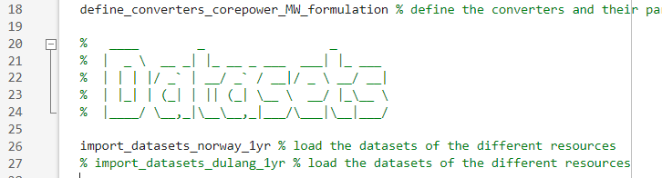{#fig:dataset_load width=100%}

## Configuration Selection

`case_sim_vec` defines which devices are included in optimization. The user can specify which configuration to use among the listed ones (see Figure 5). If the user wants to add more configurations, he/she has to start doing it from here.

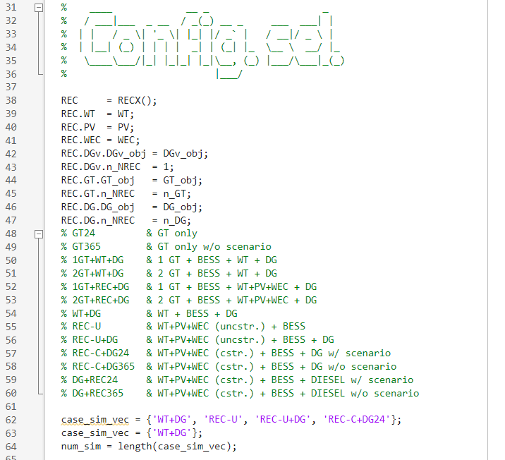{#fig:config_selection width=50%}

## Sweep Type Selection

Selection of sweep type. The sweep can be performed on the listed quantities:

- `None`: No sweep  
- `beta`: Control parameter of the Conditional Value at Risk  
- `LPSP`: Lost of Power Supply Probability (percentage)  
- `PS`: Peak shaving (percentage)  
- `Carbon_tax`: scaling factor for the nominal carbon tax  
- `PVCost`: scaling factor for the nominal PV cost  

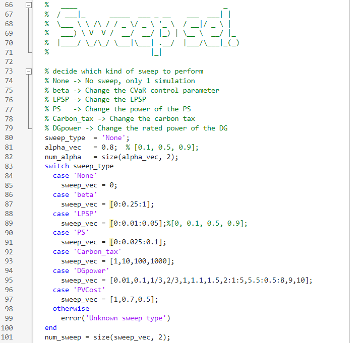{width=50%}

## Main Loop

Loop over configurations and sweeps (see Figure 6). Initially `do_power` computes generated power given the load series and converter models (Figure 7), then `optimization_setup` sets up the optimization parameters for the current case, and finally `CASE_optimization` builds and solves the optimization problem.

{#fig:main_for_loop_new width=100%}

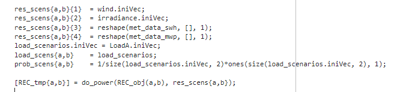{#fig:do_power width=100%}

---

# Optimization: `CASE_optimization` function

## General Notes

Optimization problem formulated as a *problem-based* approach[^1].  
Different cases handled via `switch` statements.

[^1]: https://uk.mathworks.com/help/optim/problem-based-approach.html

## Structure

1. Extract information from input  
2. Define variables  
3. Define costs  
4. Compose objective function  
5. Define constraints  
6. Solve optimization  
7. Post-process results  

## Information Extraction

Defines installed devices, load, and cost annualization factors (see Figure 8).

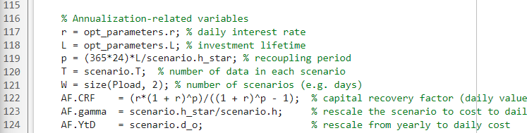{#fig:cost_ann width=80%}

## Variable Definition

Variables for each device defined in its own function (Figure 9), as for example in the GT case in Figure 10:

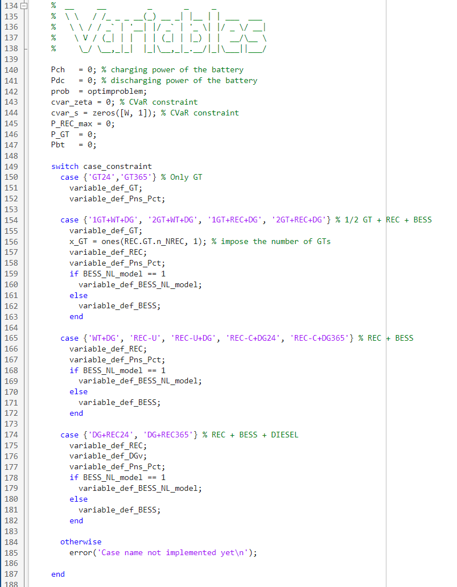{#fig:variable_def width=50%}

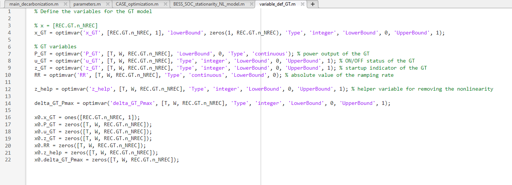{#fig:variable_def_GT width=100%}

## Cost Definition

Costs defined per asset in stage 1 and stage 2, in separate functions as shown in Figure 11, and visible in the GT example Figure 12. Afterwards, they are composed as in Figure 13.

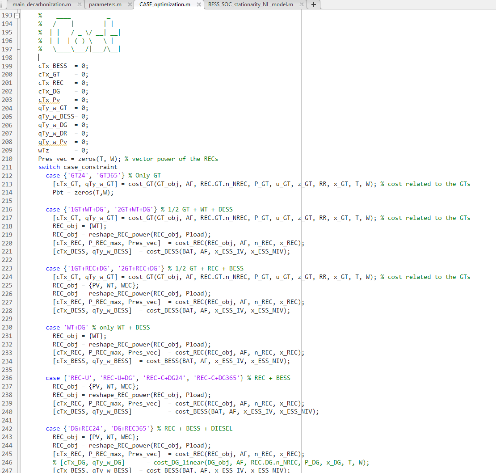{#fig:costs width=50%}

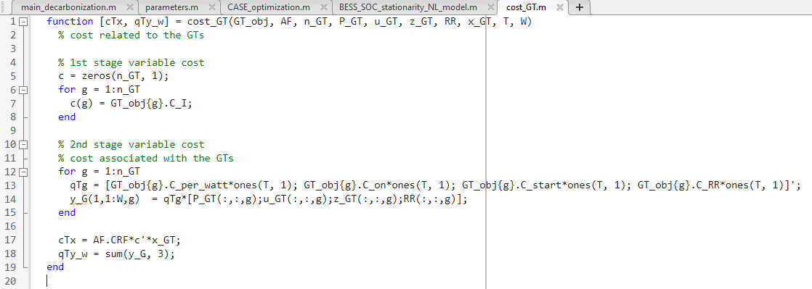{#fig:cost_GT width=100%}

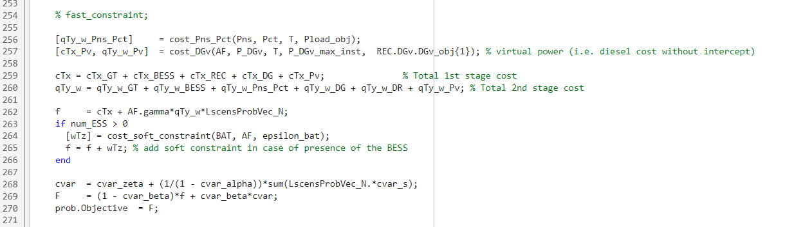{#fig:cost_composition width=100%}

## Constraints

Constraints are imposed according to the utilized devices as in Figure 14. For example, for the GT they are as in Figure 15.

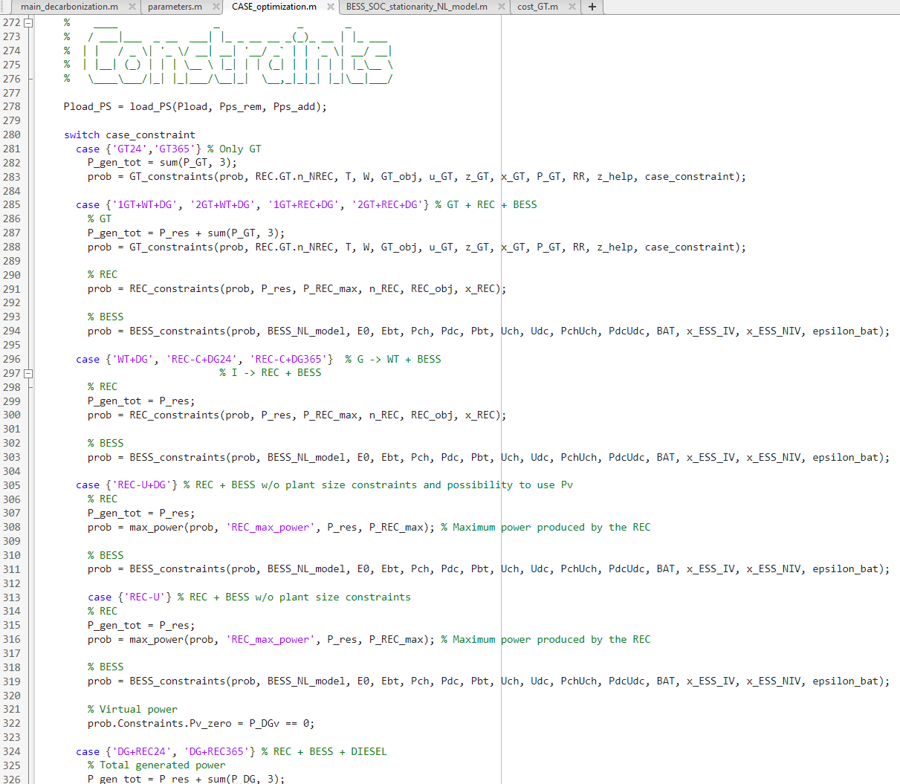{#fig:constraints_general width=60%}

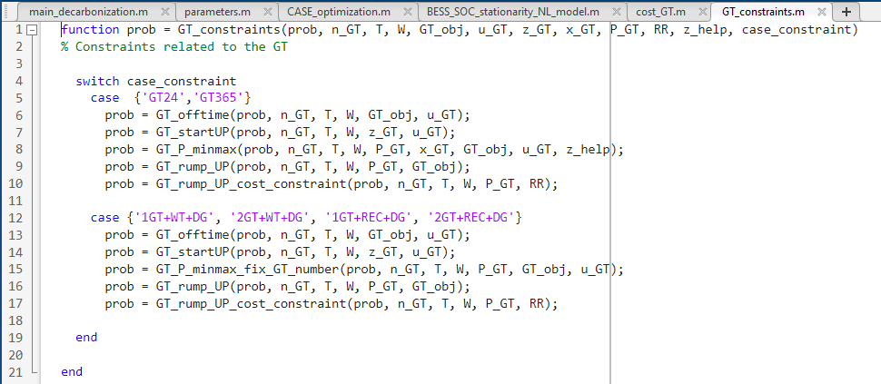{#fig:GT_constraints width=100%}

## Solving

After having defined costs and constraints, the problem is solved as in Figure 16.

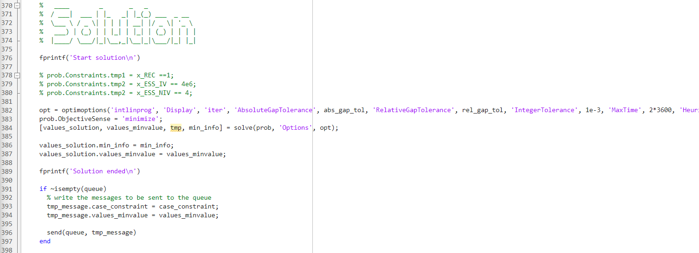{#fig:solve width=100%}

## Post-Processing

Computes costs including already installed devices, $\mathrm{CO}_2$ emissions, installed power as shown in Figure 17.

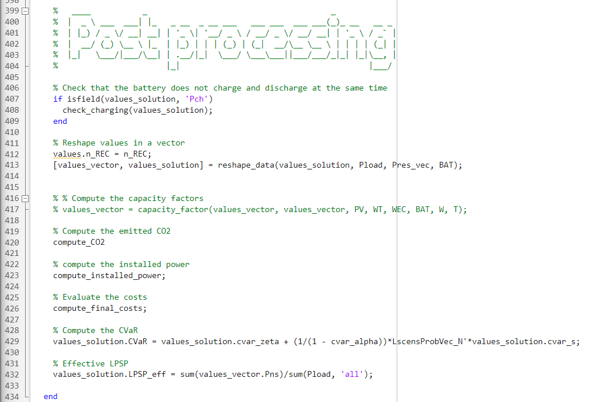{#fig:post_process width=65%}

---

# Results and Plots

The results can be displayed using `plot_decarbonization` (Figure 18)